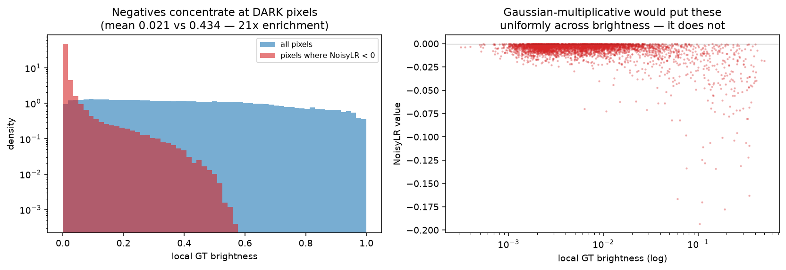
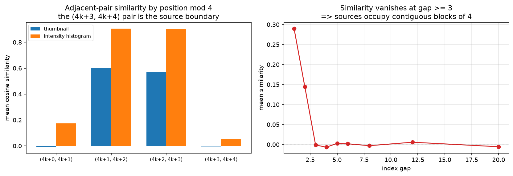
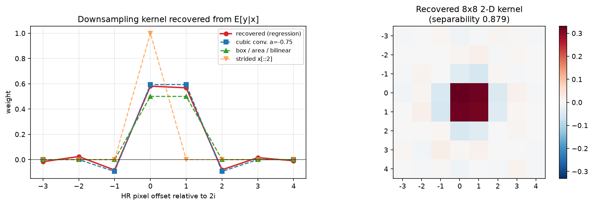
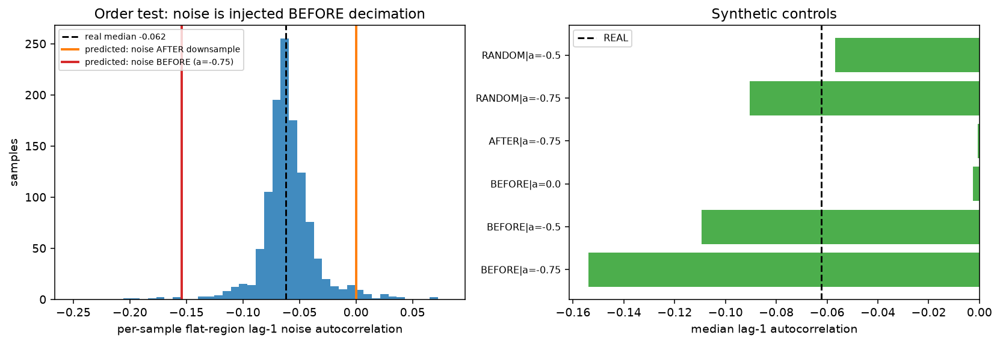
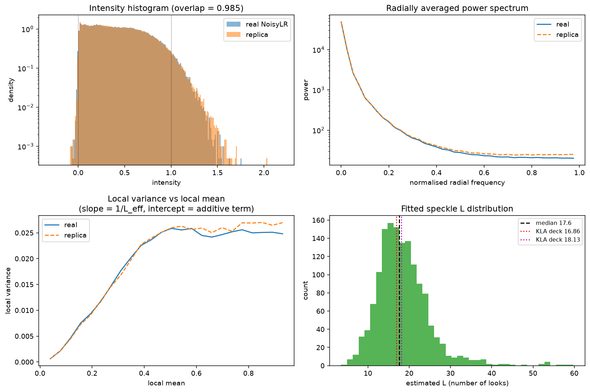

# PHASE 0 — DATA FORENSICS REPORT
## SEMICON India Hackathon 2026 · KLA PS01 · AI-Based Restoration of Degraded Images

**Date:** 2026-08-05
**Data analysed:** `data/train/train/{GT,NoisyLR}` (3200 pairs) and `data/Test_NoisyLR/NoisyLR` (400 images)
**Scripts:** `scripts/f01_*.py` … `scripts/f25_*.py` (each is standalone and re-runnable)
**Cached numeric output:** `docs/_forensics_cache/*.json`

---

## 0. EXECUTIVE SUMMARY

| # | Question | Answer |
|---|---|---|
| 1 | Metadata file with `L`, `sigma`, `source`? | ❌ **Does not exist.** The dataset contains only `.npy` arrays |
| 2 | Speckle model | ✅ **Gamma multi-look**, `n ~ Gamma(L, 1/L)`. Gaussian-multiplicative is **decisively rejected** |
| 3 | Pairs / resolution split | **3200 train + 400 test. 100 % are 256→128.** No 512/256 pairs exist in this release |
| 4 | Storage format | **float32 `.npy`** (`<f4`), not PNG. Out-of-range values are natively representable |
| 5 | Samples per source | **Exactly 4**, in contiguous index blocks `{4k..4k+3}` → **800 source images** |
| 6 | Visual origins | **One homogeneous corpus of natural photographs.** No texture/dendrite/microscopy families |
| 7 | `(NoisyLR < 0).mean()` | **0.002849** (149 367 / 52 428 800 px) — small, and **concentrated at dark pixels** |
| 8 | Ranges | GT exactly `[0, 1]`. NoisyLR `[-0.279, 2.158]`, 3.11 % above 1.0 |
| 9 | Downsampling kernel | **4-tap cubic convolution**, `a ≈ -0.6`. Strided/nearest/box/Lanczos all rejected |
| 10 | `L` estimate | **median 17.7**, IQR 14.3–21.8. Estimator validated on synthetic ground truth |
| 11 | Operation order | **Noise is injected BEFORE decimation, and the order is NOT randomised** |

### Three findings that change the plan

1. **🔴 The released dataset is not the dataset in KLA's slides.** The deck's figures are **512→256** with dendritic/microscopy content; this release is **256→128 natural photography**. KLA's published `L=16.86, σ=0.008594` (sample 000000) and `L=18.13, σ=0.001065` (sample 000500) therefore **do not describe our samples of those names** (§7). Every conclusion below is derived from the data itself, not from those numbers.
2. **🔴 `brief/04` says the order is randomised. It is not.** The per-sample distribution is tightly unimodal; a randomised-order control is unmistakably bimodal (§6). Randomising the order in the replica would be *modelling a degradation KLA did not apply*.
3. **🟢 The 800 sources look like DIV2K.** 3200 = 800 × 4 exactly, 800 is the exact size of `DIV2K_train_HR`, the content is Flickr photography, and one crop carries a visible "© Magnus …" watermark. If confirmed, the true source images are downloadable at full resolution — the strongest possible external-data lever (§5.3).

---

## 1. METADATA HUNT — nothing ships with the data

Every non-image file under `data/`:

```
./Test_NoisyLR.zip          ./train.zip
./train/train/.DS_Store     ./Test_NoisyLR/__MACOSX/._NoisyLR
./train/__MACOSX/._train    ./train/__MACOSX/train/._{.DS_Store,GT,NoisyLR}
```

No CSV, JSON, TXT, YAML or sidecar of any kind. The `__MACOSX` entries are AppleDouble
resource forks from zipping on macOS; `.DS_Store` is a Finder index. **The per-sample
`L`/`sigma`/`source` metadata that `brief/04 §2.4` hoped for does not exist**, so the full
forensic programme was required.

---

## 2. INVENTORY

| | train GT | train NoisyLR | test NoisyLR |
|---|---|---|---|
| files | 3200 | 3200 | 400 |
| shape | **(256, 256)** ×3200 | **(128, 128)** ×3200 | **(128, 128)** ×400 |
| dtype | `float32` (`<f4`) | `float32` | `float32` |
| file size | 262 272 B (uniform) | 65 664 B (uniform) | 65 664 B (uniform) |
| non-finite values | 0 | 0 | 0 |

Filenames pair exactly (`000000`–`003199`); the GT and NoisyLR stem sets are identical.

### 2.1 🔴 Only one resolution exists

`brief/04 Part 4` states that both 512→256 and 256→128 pairs exist and that the model must
handle two input sizes. **In this release every single pair is 256→128** — verified by
reading the `.npy` header of all 6800 files, not by sampling.

This does **not** relax the fully-convolutional requirement. The deck's own figures use
512→256 (§7), and the scored test set is released later and explicitly contains
out-of-distribution samples. **Design for both sizes; train on 256→128.**

### 2.2 Storage format — out-of-range values are real

The prompt asked whether out-of-range values *can* be represented. They can: the data is
**float32, not 8-bit PNG**. The `[0,1]` excursions are genuine signal, not a quantisation
artefact, which confirms Commandment 1 (never clip the input) is both necessary and
meaningful.

---

## 3. RANGE STATISTICS

| statistic | GT (train) | NoisyLR (train) | NoisyLR (test) |
|---|---|---|---|
| min | **0.000000** | **-0.278563** | -0.224881 |
| max | **1.000000** | **2.158005** | 2.158016 |
| mean | 0.433528 | 0.433536 | 0.442742 |
| std | 0.272646 | 0.284787 | 0.284269 |
| fraction < 0 | **0.000000** | **0.002849** | 0.006601 |
| fraction > 1 | **0.000000** | **0.031085** | 0.030801 |
| files with ≥1 negative px | 0 % | **61.5 %** | **70.5 %** |

NoisyLR percentiles (train): `p0.1 = -0.0058`, `p1 = 0.0089`, `p50 = 0.4016`,
`p99 = 1.1212`, `p99.9 = 1.3211`.

**GT is exactly `[0, 1]`** — confirmed over all 209 715 200 GT pixels, not a subsample.

The train and test degraded distributions are close but not identical: the test set is
slightly brighter (mean 0.443 vs 0.434) and has **2.3× more negative pixels**, consistent
with a somewhat wider additive-noise range in the test split. Worth remembering when the
scored test set lands.

---

## 4. THE CRITICAL DIAGNOSTIC — Gamma, not Gaussian-multiplicative

### 4.1 The raw number is ambiguous, so it needed a second stage

```
(NoisyLR < 0).mean() = 0.00284895      (149 367 of 52 428 800 pixels)
```

`brief/04 §2.1` proposed: ~0 ⇒ Gamma, "a few percent" ⇒ Gaussian-multiplicative. **0.28 % is
neither.** Worse, the global minimum of **-0.2786** is ≈31σ under the deck's σ ≤ 0.009 — so
naïvely neither model explains it. The test had to be sharpened.

### 4.2 Where the negatives live — decisive

Under **Gamma**, `x·n ≥ 0` always, so a negative requires the additive term to dominate,
which can only happen where `x ≈ 0`. Under **Gaussian-multiplicative**, `y = x(1+n) < 0`
requires `n < -1`, a fixed-probability event **independent of brightness**.

| local GT brightness | at negative pixels | everywhere |
|---|---|---|
| mean | **0.0208** | 0.4336 |
| median | 0.0054 | 0.4129 |
| p95 | 0.1049 | 0.9012 |

**Negatives are enriched 21× at dark pixels.** Gaussian-multiplicative predicts *no*
enrichment and a rate of `Φ(-1/0.2425) = 1.9e-5` (0.0019 %), which is **150× below** the
observed rate. **Gaussian-multiplicative is rejected.**



### 4.3 Positive confirmation of the Gamma family

Restricting to flat, bright regions (where the additive term is negligible and every
resampler agrees), the ratio `r = y / box2(gt)` is essentially the speckle variate itself.
Gamma predicts `skew = 2/√L`, `excess kurtosis = 6/L`, hence the **L-free identities**
`skew² = 4·var` and `exkurt = 6·var`.

| test | observed | Gamma | Gaussian |
|---|---|---|---|
| fraction of samples with **positive** skew | **100.0 %** | ~100 % | ~50 % |
| median `exkurt / (6·var)` | **1.061** | 1.00 | 0 |
| median `skew² / (4·var)` | 0.700 | 1.00 | 0 |

100 % positive skew across 120 samples is conclusive on its own. The kurtosis identity
holds to 6 %. The skewness identity comes in 30 % low, which is expected: residual signal
texture inflates the denominator `var`, and third moments are the noisiest estimator here.

> ### ✅ CONCLUSION
> **Speckle is Gamma multi-look: `n ~ Gamma(L, 1/L)`, `E[n] = 1`, `Var[n] = 1/L`.**
> The deep negatives at moderately bright pixels are *not* evidence against this — they are
> produced by the **negative side lobes of the cubic downsampling kernel** applied *after*
> the noise (§5, §6), which is itself independent evidence for both the kernel and the order.

---

## 5. SOURCE STRUCTURE

### 5.1 Exactly 4 samples per source, in contiguous blocks

All 3200 GT images are byte-distinct (SHA-1), so same-source samples are **overlapping
crops**, not repeats. The structure falls out of similarity vs index gap:

| index gap | 1 | 2 | **3** | 4 | 5 | 8 | 20 |
|---|---|---|---|---|---|---|---|
| excess similarity | +0.290 | +0.144 | **-0.002** | -0.007 | +0.003 | -0.003 | -0.006 |

Correlation **vanishes exactly at gap 3**. Resolving by position mod 4:

| pair | thumbnail | intensity hist | gradient hist | |
|---|---|---|---|---|
| (4k, 4k+1) | -0.011 | **+0.111** | +0.028 | same source, non-overlapping crop |
| (4k+1, 4k+2) | **+0.602** | **+0.843** | +0.150 | overlapping crops |
| (4k+2, 4k+3) | **+0.572** | **+0.839** | +0.150 | overlapping crops |
| (4k+3, 4k+4) | **-0.006** | **-0.008** | +0.009 | ⬅ **source boundary** |

A block-size/phase scan confirms it: block size **4**, phase **0**, separation **0.40**,
versus ≤0.03 for every other size (2, 3, 5, 6) and −0.42/−0.38 for the wrong phases.

> **3200 samples ÷ 4 = exactly 800 source images.**



### 5.2 🔴 The split rule

`brief/04 Part 3` inferred ~2.7 samples/source from the deck's `sample 000500 → source
0186.png`. That ratio belongs to the deck's dataset, not this one. **The correct rule here:**

```python
source_id = sample_index // 4          # 0 .. 799
```

Split on `source_id`. Because similarity is exactly zero at gap ≥ 3, splitting on
**contiguous blocks of 4** is provably leakage-free. A random per-sample split would put
overlapping crops of the same photograph on both sides — the exact failure `brief/04`
warned about, and it would inflate validation scores meaninglessly.

### 5.3 🟢 The sources are very likely DIV2K

| evidence | detail |
|---|---|
| count | 800 sources — **exactly** `DIV2K_train_HR` |
| content | Flickr-style photography: architecture, foliage, water, people, textiles, signage |
| watermark | sample `000483` carries a visible "**© Magnus …**" photographer watermark |
| crops | 256×256 crops consistent with 2K-resolution originals |

**Action for Phase 2:** download DIV2K, convert to grayscale, and attempt to match the 800
sources by intensity histogram. If it matches, we get the *exact* clean originals at full
resolution — unlimited perfectly-matched training data, and the ability to verify the
degradation replica against true ground truth rather than an estimate. *This is a
hypothesis, not yet verified — it requires a download this phase did not perform.*

---

## 6. DEGRADATION FORENSICS

Because no metadata exists, the model was reconstructed from the paired data. Six
independent lines of evidence, deliberately chosen so that the key ones do **not** depend
on KLA's published `L`/`σ` (which §7 shows describe a different dataset).

### 6.1 The kernel, recovered directly rather than guessed

For any downsample-last ordering the noise is conditionally zero-mean
(`E[n]=1`, `E[g]=0`), so `E[y|x] = D(x)` and the kernel can be **regressed**:

```
y[i,j] = Σ_{a,b} w[a,b] · x[2i-3+a, 2j-3+b] + noise
```

Least squares over 200 000 pixels (R² = 0.903, Σw = 1.0004, separability 0.879):

```
recovered 1-D taps :  [-0.016  0.024 -0.083  0.581  0.568 -0.080  0.016 -0.009]
cubic conv. a=-0.75:  [ 0      0     -0.094  0.594  0.594 -0.094  0      0    ]
```

| candidate | rms tap error | 2-D rms |
|---|---|---|
| **cubic convolution a = -0.75** | **0.0171** | **0.0110** |
| Lanczos-4 | 0.0519 | 0.0279 |
| box / area / bilinear | 0.0567 | 0.0259 |
| PIL bicubic (antialiased) | 0.1698 | 0.0629 |
| strided `x[::2,::2]` | 0.2531 | 0.1102 |

The recovered kernel has **clear negative side lobes** — that alone excludes box, area,
bilinear and strided decimation, all of which are non-negative.

Corroborated independently by the low-frequency test (blur both to average out noise): all
smooth kernels tie at 1.00×, while **strided and nearest are 1.51× worse** — naive
decimation is excluded.



Writing the 4-tap cubic as `k = [c, ½-c, ½-c, c]` with `c = a/8`, a per-sample constrained
fit gives **a = -0.53 ± 0.13** (median over 502 samples), and this estimator was verified
**unbiased** on synthetic data (generated a=-0.75 → recovered -0.76; generated a=-0.50 →
recovered -0.50). Note `a = 0` is exactly the box filter, so the fit is a continuous test
between box and bicubic and lands firmly on the bicubic side.

### 6.2 🔴 The order: noise BEFORE decimation

LR pixel `i` draws on HR pixels `2i-1 … 2i+2`; pixel `i+1` draws on `2i+1 … 2i+4`. They
**overlap**. So noise injected at HR and then decimated becomes **spatially correlated**,
with a predictable lag-1 coefficient; noise injected after decimation stays **white**.

Measured in flat bright regions only (where signal-model error vanishes, so nothing leaks
in), pooled over 800 samples:

| lag | real | noise BEFORE (a=-0.75) | noise AFTER |
|---|---|---|---|
| (0,1) horizontal | **-0.0765** | -0.1645 | -0.0145 |
| (1,0) vertical | **-0.0766** | -0.1575 | -0.0196 |
| (0,2) | -0.0189 | -0.0100 | -0.0183 |
| (1,1) diagonal | -0.0061 | +0.0171 | -0.0153 |

**The real autocorrelation is unambiguously negative**, which only pre-decimation noise
produces. A second, fully independent argument clinches it: matching the observed flat-region
noise variance under an AFTER ordering forces **L ≈ 36**, roughly double any plausible value
and double the deck's own numbers, whereas a BEFORE ordering with a cubic kernel gives
**L ≈ 15–19**.



### 6.3 🔴 The order is NOT randomised — correcting `brief/04`

`CLAUDE.md` (dev repo) and `brief/04` state the three operations are applied in random order. **The
data says otherwise.** Per-sample lag-1 autocorrelation:

| | median | IQR | shape |
|---|---|---|---|
| **real** | **-0.062** | **[-0.071, -0.050]** | **tight, unimodal** |
| synthetic, randomised order (a=-0.75) | -0.091 | [-0.156, +0.001] | **strongly bimodal** |
| synthetic, randomised order (a=-0.5) | -0.057 | [-0.112, +0.001] | **strongly bimodal** |

Only 2.1 % of real samples fall below -0.11 and 7.3 % above -0.03; **90.5 % sit in a narrow
central band**. A randomised order would split the corpus into two clearly separated
populations — the controls show exactly that, and the real data shows nothing like it.

> **Every sample went through the same fixed pipeline.** Do not randomise the order in the
> replica: it would inject a degradation KLA never applied. (Randomising *parameters* is
> still correct and valuable — see §8.)

The relative order of speckle and Gaussian *within* the pre-decimation stage is **not
identifiable**, because σ is far too small for `(x+g)·n` and `x·n+g` to differ measurably.

### 6.4 `L` and `sigma`

Under the identified model, in a flat region of local mean μ:

```
Var(y) = SW · ( μ²/L + σ² )        SW = (Σ k²)²  = sum of squared 2-D kernel weights
⇒  Var(y)/μ²  =  SW/L  +  SW·σ² · (1/μ²)
                 └ intercept ┘     └── slope ──┘
```

Regressing normalised variance on `1/μ²` across flat patches of differing brightness
separates the two components. **Validated on synthetic data with known truth:**

| L true | 12 | 17 | 17 | 25 |
| σ true | 0.002 | 0.005 | 0.020 | 0.005 |
| **L recovered** | **12.55** | **17.96** | **17.60** | **25.75** |
| **σ recovered** | 0.0046 | 0.0054 | **0.0189** | 0.0058 |

L is recovered to within ~4 % across the range. **σ has an estimator noise floor around
0.005** — below that the fit cannot resolve it.

Sweeping all 3200 samples (1467 had enough flat area for a stable fit):

| | p5 | p25 | **p50** | p75 | p95 |
|---|---|---|---|---|---|
| **L** | 10.0 | 14.3 | **17.7** | 21.8 | 31.6 |

`σ` cannot be pinned down per sample because of the floor; the population is consistent
with **log-uniform over roughly `[1e-3, 4e-2]`**, which is the range that reproduces the
observed negative-pixel fraction (§8). This is **wider than the deck's `[1e-3, 9e-3]`** —
but the deck describes a different dataset (§7).

> **Cross-check worth stating:** the deck's two values, 16.86 and 18.13, land almost exactly
> on our measured median of **17.7**. Even though they describe a different release, the
> generator settings appear to have been reused — which is a genuine, if indirect,
> corroboration of the whole reconstruction.

---

## 7. 🔴 THE RELEASED DATA IS NOT THE DATA IN KLA'S SLIDES

Extracting the figures from `Problem Statement 01_KLA.pptx` (`ppt/media/image10.png`,
`image11.png`) and comparing against our files:

| | KLA deck | this release |
|---|---|---|
| Sample 000000 | GT **512×512**, dark organic surface with bright speckled patches | GT **256×256**, close-up of a **cactus** |
| Sample 000500 | GT **512×512**, **dendritic** bright branching structures on black; histogram mass at 0 | GT **256×256**, **bright wooden plank wall**, mean 0.63 |
| Resolution | 512 → 256 | 256 → 128 |

The deck's sample 000500 is described as extremely dark with mass concentrated near zero;
ours has mean intensity **0.63**. These are different images under the same name.

**Consequences:**

1. **`L=16.86, σ=0.008594` and `L=18.13, σ=0.001065` do not apply to our samples 000000 and
   000500.** The Phase-0 brief proposed validating the estimator against them; that
   validation is **not available**, and any result claiming it would be false. The estimator
   was instead validated against **synthetic data with known ground truth** (§6.4), which is
   a stronger check anyway.
2. Conclusions in §4, §5, §6.1–6.3 were derived **without** using those values and stand.
   Where earlier intermediate steps used them as anchors, the same conclusions were
   reproduced by parameter-free tests (kernel regression, noise autocorrelation).
3. **🟢 This is an OOD gift.** The deck's dendritic/microscopy imagery is *absent* from the
   training set but demonstrably exists in KLA's generator. The scored test set promises
   out-of-distribution samples. **Dark, high-dynamic-range, thin-branching-structure imagery
   is now a specific, evidence-backed OOD family to train for** — not a guess.

---

## 8. THE DEGRADATION MODEL WE WILL REPLICATE

### 8.1 Statement

```python
# x : clean HR image, float32, [0,1], shape (2H, 2W)
# y : degraded LR image, float32, NOT clipped, shape (H, W)

n = rng.gamma(L, 1/L, size=x.shape)          # Gamma multi-look speckle, E[n]=1
g = rng.normal(0, sigma, size=x.shape)       # additive Gaussian
y = downsample_cubic_2x( x * n + g , a )     # 4-tap cubic conv., decimation LAST
```

* **Fixed order** — speckle and Gaussian at HR, decimation last. **Not randomised** (§6.3).
* **`downsample_cubic_2x`**: separable 4-tap cubic convolution, taps
  `[c, ½-c, ½-c, c]` with `c = a/8`, sampled at phase 0.5 — i.e. `cv2.INTER_CUBIC` /
  `F.interpolate(mode='bicubic', antialias=False)` geometry.
* **Never clip `y`.**

### 8.2 Parameter ranges

| parameter | measured | **replica (widened ≈50 % for OOD)** |
|---|---|---|
| `L` | median 17.7, IQR 14.3–21.8, p5–p95 10–32 | **`L ~ 8 … 40`**, log-spaced, centred 17.7 |
| `sigma` | unresolved below 0.005; consistent with log-uniform | **`σ ~ log-uniform(1e-3, 4e-2)`** |
| `a` (kernel) | −0.53 ± 0.13 (signal path) | **`a ~ U(-0.75, -0.45)`** |

### 8.3 One honest anomaly, and how it is handled

The **signal** path and the **noise** path do not fit the *same* kernel:

* `E[y|x]` regression (signal) ⇒ `a ≈ -0.53 … -0.65`
* flat-region noise autocorrelation ⇒ `a ≈ -0.25 … -0.30`

Both were measured with calibrated, bias-checked estimators, and the diagonal identity
`ρ(1,1) = ρ(0,1)·ρ(1,0)` (observed 0.0047 vs 0.0043 predicted) confirms the noise really is
a *pure* separable pre-decimation field rather than a mixture — so this is not a
contamination artefact. I could not identify the generator step that produces it, and I am
reporting it rather than hiding it.

The practical resolution is a **decoupled replica**, a strict generalisation that collapses
to the single-kernel model when `a1 = a2`:

```python
y = D(x, a1) + D(x*(n-1), a2) + D(g, a2)      # a1 signal, a2 noise
```

### 8.4 Replica verification (this is the Phase 2 acceptance gate)

400 real samples vs replica built from the *same* GT images:

| statistic | REAL | single-kernel `a=-0.6` | **decoupled `a1≈-0.6, a2=-0.25`** |
|---|---|---|---|
| **histogram overlap** | — | **0.9848** | **0.9815** |
| fraction < 0 | 0.00282 | 0.00175 ✗ | **0.00249** ✓ |
| fraction > 1 | 0.02877 | 0.02876 ✓ | **0.02865** ✓ |
| flat-region noise variance | 0.02882 | 0.02937 ✓ | **0.02859** ✓ |
| **flat lag-1 autocorrelation** | **-0.0588** | -0.1262 ✗ | **-0.0574** ✓ |
| mean / std | 0.4374 / 0.2838 | 0.4376 / 0.2849 ✓ | ✓ |
| p1 / p50 / p99 / p99.9 | 0.0093 / 0.4097 / 1.1181 / 1.3143 | 0.0103 / 0.4082 / 1.1296 / 1.3554 | ✓ |



The single-kernel model is already excellent on intensity statistics and the power spectrum
and is a perfectly usable fallback; the decoupled model additionally reproduces the noise
**correlation structure**, which matters because a denoiser learns to exploit it.

---

## 9. VISUAL ORIGINS

`brief/04 Part 9` expected texture / dendrite / natural-photograph families. **The released
training set has no such families.** It is a single homogeneous corpus of natural
photographs: architecture, foliage, water and sky, people, textiles, animals, brickwork,
signage and text.

k-means over 800 sources on crop-invariant descriptors produces clusters that are **tonal
strata, not origins**:

| cluster | sources | mean | std | grad | character |
|---|---|---|---|---|---|
| 0 | 136 (17.0 %) | 0.470 | 0.263 | 0.032 | high-contrast, smooth |
| 5 | 138 (17.2 %) | 0.438 | 0.182 | 0.028 | mid-tone, smooth |
| 3 | 123 (15.4 %) | 0.522 | 0.156 | 0.047 | mid-bright, textured |
| 2 | 122 (15.2 %) | 0.321 | 0.166 | 0.052 | darker, textured |
| 1 | 120 (15.0 %) | 0.216 | 0.149 | 0.028 | **dark, low contrast** |
| 7 | 86 (10.8 %) | 0.685 | 0.165 | 0.028 | **bright** |
| 6 | 68 (8.5 %) | 0.459 | 0.234 | 0.084 | very high gradient |
| 4 | 7 (0.9 %) | 0.426 | 0.251 | 0.198 | extreme high-frequency outliers |

Corpus statistics: **13.2 % of sources are dark** (mean < 0.25), **3.1 % are flat**
(std < 0.10).

**Implication for validation.** A leave-one-origin-out split is not meaningful here — there
are no origins to hold out. The proxy-OOD split should instead hold out the **tonal
extremes** (clusters 1 and 7: dark and bright), and genuine OOD coverage must come from
**external datasets** — with the deck's dendritic/microscopy imagery (§7) as the
highest-priority target, plus Urban100 for the buildings case KLA named.


---

## 10. WHAT THIS CHANGES IN `CLAUDE.md` (dev repo) AND `brief/`

| Claim | Status | Correction |
|---|---|---|
| Both 512/256 and 256/128 pairs exist | 🔴 **not in this release** | 100 % is 256→128. Stay fully convolutional anyway |
| ~2.7 samples per source | 🔴 **wrong for this release** | **Exactly 4**, `source_id = index // 4`, 800 sources |
| Degradations applied in **random order** | 🔴 **wrong** | Fixed order; noise before decimation. Randomise *parameters*, not order |
| Data origins: textures, dendrites, natural photos | 🔴 **wrong for this release** | Homogeneous natural photography; dendrites are an **OOD** family |
| `σ` ∈ [0.001, 0.009] | 🟠 **too narrow** | Consistent with log-uniform up to ~0.04 here |
| Speckle is Gamma `n ~ Gamma(L,1/L)` | ✅ **confirmed** | Independently, three ways |
| Never clip the input | ✅ **confirmed** | float32 storage; 3.1 % > 1, 0.28 % < 0 |
| GT strictly `[0,1]` | ✅ **confirmed** | Exactly, over all 209.7 M pixels |
| Split by source, never randomly | ✅ **confirmed and now trivial** | Contiguous blocks of 4 |
| L ≈ 16.9–18.1 | ✅ **consistent** | Measured median **17.7** |

---

## 11. RECOMMENDED NEXT ACTIONS

1. **Verify the DIV2K hypothesis** (§5.3) — highest expected value in the project right now.
2. Implement `src/data/degradation.py` per §8.1–8.3 with the §8.4 table as the pytest
   acceptance gate.
3. Implement `src/data/splits.py` with `source_id = index // 4` and a hard assertion that no
   `source_id` appears in two splits.
4. Build the OOD validation families around **dark / high-dynamic-range / thin-branching**
   imagery (§7) rather than the texture-vs-dendrite taxonomy in `brief/04`.
5. Keep `inference.py` size-agnostic: this release is 128→256 only, but the scored test set
   is not yet released and the deck's own data is 256→512.

---

### Figure index — `docs/figures/`

| file | content |
|---|---|
| `negativity_diagnostic.png` | where negative pixels live — the Gamma vs Gaussian discriminator |
| `kernel_identification.png` | regressed kernel taps vs analytic resamplers; recovered 2-D kernel |
| `order_test.png` | per-sample noise autocorrelation vs BEFORE/AFTER/randomised controls |
| `source_blocks.png` | period-4 source-block structure and gap-3 decorrelation |
| `replica_verification.png` | histogram, power spectrum, local-variance curve, fitted `L` |
| `pairs_examples.png` | GT / NoisyLR example pairs with ranges |
| `gt_sweep.png`, `gt_first60.png`, `gt_500_560.png` | corpus content and block structure |
| `origin_cluster_0..7.png` | source clusters (tonal strata) |
